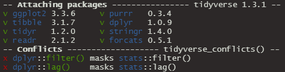

```{r setup, include=FALSE}
knitr::opts_chunk$set(
  echo = TRUE,
  warning = TRUE,
  error = TRUE,
  echo = TRUE,
  message = FALSE,
  collapse = TRUE,
  cache = TRUE)

library <- function(...) {
  suppressPackageStartupMessages(
    suppressWarnings(
      base::library(...)))}

require <- function(...) {
  stop("DO NOT USE require() WHILE TEACHING!")}

library(tidyverse)

```

## Session #6: Data Wrangling

> Shaping raw data so it may be used to build a model is a key task 
> for any actuary or data scientist. This session will walk through 
> some basic tasks to take information and **transform** it into something useful. 
> We will cover topics like **filtering**, **grouping** and **aggregation** and 
> **combining** multiple sources of data. 
> Examples will use the `tidyverse` packages in R including `dplyr`.


## Load `tidyverse`

```{r}
library(tidyverse)
```




## Loaded packages

| Package    | Description                                                                        | 
|------------|------------------------------------------------------------------------------------| 
| `ggplot2`  | A system for 'declaratively' creating graphics                                     | 
| `tibble`   | The tibble class is a re-implementation of the data frame                          | 
| `tidyr`    | Tools to help to create tidy data: pivoting, unnesting, rectangling, and imputing  | 
| `readr`    | Provides a fast and friendly way to read rectangular data                          | 
| `purrr`    | A complete and consistent functional programming toolkit for R                     | 
| `dplyr`    | A fast & consistent tool for working with data frames                              | 
| `stringr`  | A consistent, simple and easy to use set of string functions                       | 
| `forcats`  | Tools for working with factors                                                     | 


## Data for today's presentation

`CAS` here stands for _Computational Actuarial Science with R_,
by several authors and edited by Arthur Charpentier.

```{r eval=FALSE}
install.packages(
  c('xts', 'sp'), 
  type = 'binary')

install.packages(
  'CASdatasets', 
  repos = 'http://cas.uqam.ca/pub/')

library(CASdatasets)
```


```{r}
data(Davis, package = 'CASdatasets')
dim(Davis)
rm(Davis)
```