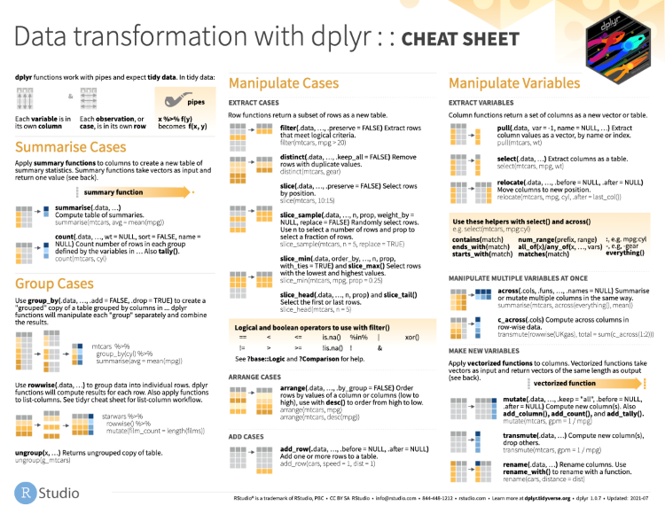

```{r setup, include=FALSE}
knitr::opts_chunk$set(
  echo = TRUE,
  warning = TRUE,
  error = TRUE,
  echo = TRUE,
  message = FALSE,
  # collapse = TRUE,
  cache = TRUE)

library <- function(...) {
  suppressPackageStartupMessages(
    suppressWarnings(
      base::library(...)))}

require <- function(...) {
  stop("DO NOT USE require() WHILE TEACHING!")}

library(tidyverse)

options("tibble.print_min" = 5)
options("tibble.print_max" = 5)
options("tibble.max_footer_lines" = 2)
options("tibble.max_extra_cols" = 4)
options("tibble.width" = 60)

```

## Session #6: Data Wrangling

> Shaping raw data so it may be used to build a model is a key task 
> for any actuary or data scientist. This session will walk through 
> some basic tasks to take information and **transform** it into something useful. 
> We will cover topics like **filtering**, **grouping** and **aggregation** and 
> **combining** multiple sources of data. 
> Examples will use the `tidyverse` packages in R including `dplyr`.


## Load `tidyverse`

```{r}
library(tidyverse)
```


## Loaded packages

| Package    | Description                                                                        | 
|------------|------------------------------------------------------------------------------------| 
| `ggplot2`  | A system for 'declaratively' creating graphics                                     | 
| `tibble`   | The tibble class is a re-implementation of the data frame                          | 
| `tidyr`    | Tools to help to create tidy data: pivoting, unnesting, rectangling, and imputing  | 
| `readr`    | Provides a fast and friendly way to read rectangular data                          | 
| `purrr`    | A complete and consistent functional programming toolkit for R                     | 
| `dplyr`    | A fast & consistent tool for working with data frames                              | 
| `stringr`  | A consistent, simple and easy to use set of string functions                       | 
| `forcats`  | Tools for working with factors                                                     | 


## Get the `dplyr` cheatsheet!

https://www.rstudio.com/resources/cheatsheets/




## The pipe operator

The `tidyverse` packages, especially `dplyr` rely heavily on an operator
that is not included in R by default -- the pipe operator, or `%>%`.
We use the pipe operator to chain functions that we would otherwise
have to nest.


Shortcut key is `CTRL-SHIFT-M`


## A fun pipe example

What is the distribution of token lengths in a corpus like
Bram Stoker's _Dracula_?

```{r eval=FALSE}
dracula <- readr::read_file(
  'http://gutenberg.org/cache/epub/345/pg345.txt')
dracula_words <- strsplit(dracula, split = '\\s+')
```

```{r echo=FALSE}
dracula <- readr::read_file('dracula.txt')
dracula_words <- strsplit(dracula, split = '\\s+')
```


## Chain of functions

```{r out.height = "200px", out.width="350px"}
words <- unlist(dracula_words)
words_lower <- tolower(words)
nchar_words <- nchar(words_lower)
nchar_words10 <- pmin(nchar_words, 10)
table_words10 <- table(nchar_words10)
barplot(table_words10, names.arg = c(1:9, '10+'))
```

That's a lot of new variables.


## Combine as one
```{r eval=FALSE}
unlist(dracula_words)
tolower(unlist(dracula_words))
nchar(tolower(unlist(dracula_words)))
pmin(nchar(tolower(unlist(dracula_words))), 10)
table(pmin(nchar(tolower(unlist(dracula_words))), 10))

# Fully nested!
barplot(table(pmin(
  nchar(tolower(unlist(dracula_words))), 10)), 
  names.arg = c(1:9, '10+'))
```

That's hard to read.


## Pipe it!
```{r out.height = "200px", out.width="350px"}
dracula_words %>% 
  unlist() %>% 
  tolower() %>% 
  nchar() %>% 
  pmin(10) %>% 
  table() %>% 
  barplot(names.arg = c(1:9, '10+'))
```


## Data for today's examples

```{r eval=FALSE}
install.packages(
  c('xts', 'sp'), 
  type = 'binary')

install.packages(
  'CASdatasets', 
  repos = 'http://cas.uqam.ca/pub/')

library(CASdatasets)
```

`CAS` here stands for _Computational Actuarial Science with R_,
by several authors and edited by Arthur Charpentier.


## Brazilian Vehicle Insurance Data

```{r}
data(brvehins1a, package = 'CASdatasets')
brvehins1a <- as_tibble(brvehins1a)
```

When printed to the console, tibbles generate output that is more user friendly
than data frames when the data set is large.

```{r}
print(brvehins1a)
```


## Select columns using `select`

```{r}
brvehins1a %>% 
  select(ExposTotal, PremTotal)
```


## Anti-select operator

```{r eval=FALSE}
brvehins1a %>% 
  select(-Gender, -ClaimNbFire)
```

You can only remove columns that actually exist.

```{r}
brvehins1a %>% 
  select(-DriverAge)
```


## Extract vectors using `pull`

`select` gives you a tibble, even if you only get one column of data.
If you want to get a single vector instead of a one-column tibble, use `pull`.

```{r eval=FALSE}
brvehins1a %>% 
  pull(PremTotal)
```

If you pass two columns to `pull` you get a named vector.
That may or may not make any sense depending on the data you have.

```{r}
brvehins1a %>% 
  pull(PremTotal, Gender) %>% 
  head
```


## Helper functions for `select`

* `contains`
* `ends_with`
* `starts_with`
* `matches`
* `num_range`
* `all_of`
* `any_of`
* `everything`


## Helper function examples

```{r eval=FALSE}
brvehins1a %>% 
  select(contains('Veh'))

brvehins1a %>% 
  select(ends_with('Total'))

brvehins1a %>% 
  select(starts_with('claim'))

brvehins1a %>% 
  select(matches('claim.*coll'))
```


## Extract rows using `filter`

Any function that returns a vector of `TRUE` and `FALSE` values works.

* `==`, `<`, `>`, `<=`, etc.
* `is.na`
* `%in%`
* `stringr::str_detect` and `stringr::str_starts`
* And many more


## Simple examples

```{r}
brvehins1a %>% 
  filter(Gender == 'Male')
```

```{r eval=FALSE}
brvehins1a %>% 
  filter(
    PremTotal > 250e3,
    VehYear == 2011,
    Gender != 'Corporate')
```


## Using `stringr` functions with `filter`

```{r}
brvehins1a %>% 
  filter(
    PremTotal > 250e3,
    VehYear == 2011,
    !str_starts(Gender, 'C|c'))
```    


## Remove incomplete rows with `drop_na`

Our data frame has 393,071 rows, but 83,484 observations have `NA` values
in at least one column.  You can drop those rows quickly with `drop_na`.
It *may not* be the right thing to do for your analysis, but the power is yours.

```{r eval=FALSE}
brvehins1a %>% 
  drop_na()
```

If you want to only look at certain columns, you can pass any "tidy select"
commands to `drop_na`, too.

```{r eval=FALSE}
brvehins1a %>% 
  drop_na(Gender, DrivAge, contains('total'))
```


## Extract rows using `slice`

```{r}
brvehins1a %>%
  select(ExposTotal, PremTotal) %>% 
  slice(10:11)
```


## Adding computed colums using `mutate`

```{r}
brvehins1a %>%
  select(ExposTotal, PremTotal) %>% 
  mutate(
    PremPerExpos = PremTotal / ExposTotal,
    PremPerExpos_e3 = PremPerExpos / 1000)
```


## Rename columns using `rename`

```{r}
brvehins1a %>% 
  select(DrivAge, State) %>% 
  rename(
    DriverAge = DrivAge,
    Province = State) %>% 
  filter(Province == 'Sao Paulo')
```


## Summary data using `group_by` and `summarize`

```{r}
brvehins1a %>% 
  group_by(State) %>% 
  summarize(
    PremiumPerState = sum(PremTotal),
    ExposuresPerState = sum(ExposTotal)) %>% 
  mutate(
    AvgPremPerExposure = PremiumPerState / ExposuresPerState)
```


## Summarized counts using `n`

```{r}
brvehins1a %>% 
  group_by(State) %>% 
  summarize(
    StateCount = n()) %>% 
  filter()
```


## Another grouping example

```{r}
brvehins1a %>% 
  group_by(Gender) %>% 
  summarize(
    Premium = sum(PremTotal),
    Exposures = sum(ExposTotal))
```


## Dealing with `NA` using `coalesce`

You can use `coalesce` anywhere, even outside of a `dplyr` pipe,
to convert `NA` values to a default *in place* without having to use
a more verbose option like `ifelse`.


```{r}
brvehins1a %>% 
  group_by(Gender) %>% 
  summarize(
    Premium = sum(PremTotal),
    Exposures = sum(ExposTotal)) %>% 
  mutate(Gender = coalesce(Gender, 'UNKNOWN'))
```


## Sort using `arrange`

Sort by a column in ascending or descending order.  The following is descending.
Use `arrange('Exposures')` to get the default ascending order.

```{r}
brvehins1a %>% 
  group_by(Gender) %>% 
  summarize(
    Premium = sum(PremTotal),
    Exposures = sum(ExposTotal)) %>% 
  mutate(Gender = coalesce(Gender, 'UNKNOWN')) %>% 
  arrange(desc(Exposures))
```


## Tidy version of `rbind` with `bind_rows`

The `brvehins1a` data in `CASdatasets` is actually just one-fifth of the 
full data set.  We can get the full data in one object using `bind_rows`.

```{r}
data(
  brvehins1b, 
  brvehins1c, 
  brvehins1d,
  brvehins1e,
  package = 'CASdatasets')

brvehins1 <- brvehins1a %>% 
  bind_rows(brvehins1b, brvehins1c, brvehins1d, brvehins1e)

dim(brvehins1)
```


## Combining data

```{r}
```


## Different types of joins

```{r}
```


## Specify join parameters

```{r}
```


## Pivoting data

```{r}
```
